# BetterLaser ERP 系统 - AI 开发指导文档

> 最后更新：2026-02-02
> 项目类型：Django 5.0 ERP 系统
> 代码规模：约 74,190 行 Python 代码

---

## 变更记录

### 2026-02-02
- 完成全仓架构分析
- 生成根级与模块级 CLAUDE.md 索引
- 建立 .claude/index.json 索引系统

---

## 项目愿景

BetterLaser ERP 是专为激光设备制造企业设计的全功能 ERP 系统，实现了从销售、采购、库存到财务的完整业务闭环。系统采用 Django 5.0 + Django REST Framework 3.15 构建，集成了 AI 智能助手、电商平台数据采集、多平台电商同步等创新功能。

**核心价值**：
- 完整的业务闭环：报价→订单→发货→收款→核销
- 智能化辅助：AI 多渠道集成（钉钉、微信、Telegram）
- 电商生态：6 大主流电商平台对接（淘宝、京东、拼多多、抖音、快手、1688）
- 财务合规：含税价格体系，符合中国税务实务
- 特色功能：采购借用管理、打印模板设计器

---

## 架构总览

### 技术栈

**后端核心**：
- Django 5.0.9 - 主框架
- Django REST Framework 3.15.2 - API 框架
- drf-spectacular 0.27.2 - OpenAPI 文档生成
- Celery 5.3.4 - 异步任务队列
- Redis 6.0+ - 缓存和消息队列

**数据库**：
- 开发环境：SQLite 3.36+
- 生产环境：MySQL 8.0+
- ORM：Django ORM + django-mptt 0.15.0（树形结构）

**前端技术**：
- Tailwind CSS 3.4.18 - CSS 框架
- Alpine.js 3.14.3 - 轻量级 JS 框架
- HiPrint - 打印引擎

**认证与安全**：
- JWT 认证 (PyJWT 2.8.0)
- RBAC 权限控制
- Session 认证支持

### 系统架构图

```mermaid
graph TD
    A["(根) BetterLaser ERP"] --> B["核心业务层"]
    A --> C["集成层"]
    A --> D["基础设施层"]

    B --> E["销售管理 (sales/)"]
    B --> F["采购管理 (purchase/)"]
    B --> G["库存管理 (inventory/)"]
    B --> H["财务管理 (finance/)"]
    B --> I["客户管理 (customers/)"]
    B --> J["供应商管理 (suppliers/)"]
    B --> K["产品管理 (products/)"]

    C --> L["AI 智能助手 (ai_assistant/)"]
    C --> M["电商同步 (ecomm_sync/)"]
    C --> N["采集管理 (collect/)"]
    C --> O["物流管理 (logistics/)"]
    C --> P["商业智能 (bi/)"]

    D --> Q["核心基础 (core/)"]
    D --> R["用户管理 (users/)"]
    D --> S["认证授权 (authentication/)"]
    D --> T["部门管理 (departments/)"]

    click E "./sales/CLAUDE.md" "查看销售模块文档"
    click F "./purchase/CLAUDE.md" "查看采购模块文档"
    click G "./inventory/CLAUDE.md" "查看库存模块文档"
    click H "./finance/CLAUDE.md" "查看财务模块文档"
    click I "./customers/CLAUDE.md" "查看客户模块文档"
    click J "./suppliers/CLAUDE.md" "查看供应商模块文档"
    click K "./products/CLAUDE.md" "查看产品模块文档"
    click L "./ai_assistant/CLAUDE.md" "查看 AI 助手文档"
    click M "./ecomm_sync/CLAUDE.md" "查看电商同步文档"
    click N "./collect/CLAUDE.md" "查看采集管理文档"
    click Q "./core/CLAUDE.md" "查看核心模块文档"
    click R "./users/CLAUDE.md" "查看用户模块文档"
    click S "./authentication/CLAUDE.md" "查看认证模块文档"
    click T "./departments/CLAUDE.md" "查看部门模块文档"
```



---

## 模块结构图（Mermaid）

```mermaid
graph TD
    Root["(根) django_erp"] --> Apps["apps/"]

    Apps --> Core["core/ - 核心基础设施"]
    Apps --> Users["users/ - 用户管理"]
    Apps --> Auth["authentication/ - 认证授权"]
    Apps --> Depts["departments/ - 部门管理"]

    Apps --> Sales["sales/ - 销售管理"]
    Apps --> Purchase["purchase/ - 采购管理"]
    Apps --> Inventory["inventory/ - 库存管理"]
    Apps --> Finance["finance/ - 财务管理"]

    Apps --> Customers["customers/ - 客户管理"]
    Apps --> Suppliers["suppliers/ - 供应商管理"]
    Apps --> Products["products/ - 产品管理"]

    Apps --> AI["ai_assistant/ - AI 智能助手"]
    Apps --> Ecomm["ecomm_sync/ - 电商同步"]
    Apps --> Collect["collect/ - 采集管理"]
    Apps --> Logistics["logistics/ - 物流管理"]
    Apps --> BI["bi/ - 商业智能"]

    click Core "./core/CLAUDE.md" "查看核心模块文档"
    click Users "./users/CLAUDE.md" "查看用户模块文档"
    click Auth "./authentication/CLAUDE.md" "查看认证模块文档"
    click Depts "./departments/CLAUDE.md" "查看部门模块文档"
    click Sales "./sales/CLAUDE.md" "查看销售模块文档"
    click Purchase "./purchase/CLAUDE.md" "查看采购模块文档"
    click Inventory "./inventory/CLAUDE.md" "查看库存模块文档"
    click Finance "./finance/CLAUDE.md" "查看财务模块文档"
    click Customers "./customers/CLAUDE.md" "查看客户模块文档"
    click Suppliers "./suppliers/CLAUDE.md" "查看供应商模块文档"
    click Products "./products/CLAUDE.md" "查看产品模块文档"
    click AI "./ai_assistant/CLAUDE.md" "查看 AI 助手文档"
    click Ecomm "./ecomm_sync/CLAUDE.md" "查看电商同步文档"
    click Collect "./collect/CLAUDE.md" "查看采集管理文档"
```



---

## 模块索引

| 模块路径 | 职责描述 | 状态 | 文档 |
|---------|---------|------|------|
| **core/** | 核心基础设施：BaseModel、审计日志、通知系统、单据号生成 | ✅ 完整 | [CLAUDE.md](./core/CLAUDE.md) |
| **users/** | 用户管理：用户、角色、权限、操作日志 | ✅ 完整 | [CLAUDE.md](./users/CLAUDE.md) |
| **authentication/** | 认证授权：JWT/Session 认证、RBAC、API 文档 | ✅ 完整 | [CLAUDE.md](./authentication/CLAUDE.md) |
| **departments/** | 部门管理：组织架构、人员分配 | ✅ 完整 | [CLAUDE.md](./departments/CLAUDE.md) |
| **sales/** | 销售管理：报价、订单、发货、退货、打印模板 | ✅ 完整 | [CLAUDE.md](./sales/CLAUDE.md) |
| **purchase/** | 采购管理：询价、订单、收货、借用、质检 | ✅ 完整 | [CLAUDE.md](./purchase/CLAUDE.md) |
| **inventory/** | 库存管理：仓库、出入库、调拨、盘点、库存调整 | ✅ 完整 | [CLAUDE.md](./inventory/CLAUDE.md) |
| **finance/** | 财务管理：应收应付、收付款、费用、会计核算、报表 | ✅ 完整 | [CLAUDE.md](./finance/CLAUDE.md) |
| **customers/** | 客户管理：客户信息、联系人、价格表、往来账务 | ✅ 完整 | [CLAUDE.md](./customers/CLAUDE.md) |
| **suppliers/** | 供应商管理：供应商信息、产品目录、评估、往来账务 | ✅ 完整 | [CLAUDE.md](./suppliers/CLAUDE.md) |
| **products/** | 产品管理：产品、分类、品牌、单位、BOM、价格 | ✅ 完整 | [CLAUDE.md](./products/CLAUDE.md) |
| **ai_assistant/** | AI 智能助手：多渠道集成（钉钉、微信、Telegram） | ✅ 完整 | 待生成 |
| **ecomm_sync/** | 电商同步：6 大平台适配器、Listing 管理、订单同步 | ✅ 完整 | 待生成 |
| **collect/** | 采集管理：电商数据采集统一管理 | ✅ 完整 | 待生成 |
| **logistics/** | 物流管理：物流跟踪、配送管理 | ⚠️ 规划中 | 待生成 |
| **bi/** | 商业智能：数据分析、报表、BI | ⚠️ 规划中 | 待生成 |

---

## 运行与开发

### 环境要求

- Python 3.8+（推荐 3.13.5）
- Node.js 16+（用于前端构建）
- SQLite（开发）或 MySQL 8.0+（生产）
- Redis 6.0+（可选，用于缓存和 Celery）

### 常用命令

#### 开发环境启动
```bash
# 安装依赖
pip install -r requirements.txt
npm install

# 数据库迁移
python manage.py makemigrations
python manage.py migrate

# 创建超级用户
python manage.py createsuperuser

# 构建前端资源（开发模式，监听 CSS 变更）
npm run dev

# 启动开发服务器
python manage.py runserver

# 访问系统
# 开发服务器：http://127.0.0.1:8000
# 登录页面：http://127.0.0.1:8000/login/
# API 文档：http://127.0.0.1:8000/api/schema/
```

#### 生产环境部署
```bash
# 构建前端资源（压缩 CSS）
npm run build

# 收集静态文件
python manage.py collectstatic --noinput

# 启动 Celery worker（可选）
celery -A django_erp worker -l info

# 使用 Gunicorn 启动
gunicorn django_erp.wsgi:application
```

#### 数据库操作
```bash
# 创建迁移文件
python manage.py makemigrations

# 查看待应用的迁移
python manage.py makemigrations --dry-run --verbosity 3

# 应用迁移
python manage.py migrate

# 撤销最后一次迁移
python manage.py migrate <app_name> <previous_migration_number>

# 创建空迁移（用于手动编写迁移）
python manage.py makemigrations --empty <app_name>
```

#### 测试与代码质量
```bash
# 运行所有测试
python manage.py test

# 运行特定模块测试
python manage.py test apps.sales
python manage.py test apps.core

# 运行特定测试文件
python manage.py test apps.sales.tests.test_models

# 详细输出
python manage.py test -v 2

# 保留测试数据库（用于调试）
python manage.py test --keepdb

# 代码覆盖率
coverage run --source='.' manage.py test
coverage report
coverage html
```

#### Django Shell
```bash
# 进入 Django Shell
python manage.py shell

# 常用操作
from apps.sales.models import SalesOrder
from apps.products.models import Product

# 查询数据
orders = SalesOrder.objects.filter(status='draft')
products = Product.objects.filter(is_deleted=False)

# 创建数据
order = SalesOrder.objects.create(
    order_number='SO20250202001',
    customer_id=1,
    order_date='2025-02-02'
)
```

### 目录结构

```
django_erp/
├── django_erp/                # Django 项目配置
│   ├── settings.py           # 项目配置
│   ├── urls.py               # 根 URL 路由
│   ├── wsgi.py               # WSGI 入口
│   └── celery.py             # Celery 配置
├── apps/                      # 应用模块（15 个）
│   ├── core/                 # 核心基础设施
│   ├── users/                # 用户管理
│   ├── authentication/       # 认证授权
│   ├── sales/                # 销售管理
│   ├── purchase/             # 采购管理
│   ├── inventory/            # 库存管理
│   ├── finance/              # 财务管理
│   ├── customers/            # 客户管理
│   ├── suppliers/            # 供应商管理
│   ├── products/             # 产品管理
│   ├── departments/          # 部门管理
│   ├── ai_assistant/         # AI 智能助手
│   ├── ecomm_sync/           # 电商同步
│   ├── collect/              # 采集管理
│   ├── logistics/            # 物流管理
│   └── bi/                   # 商业智能
├── templates/                 # Django 模板（241 个文件）
├── static/                    # 静态资源
│   ├── css/                  # Tailwind CSS（编译后）
│   ├── js/                   # JavaScript 文件
│   └── libs/                 # 第三方库
├── media/                     # 用户上传文件
├── docs/                      # 项目文档
├── scripts/                   # 实用脚本
├── requirements.txt           # Python 依赖
├── package.json              # Node.js 依赖
├── tailwind.config.js        # Tailwind 配置
├── manage.py                 # Django 管理脚本
└── README.md                 # 项目说明
```

---

## 核心架构模式

### 1. 模型继承体系

所有业务模型继承自 `core.models.BaseModel`：

```python
class BaseModel(TimeStampedModel, SoftDeleteModel):
    """
    组合了时间戳和软删除功能的完整基类
    """
    # 自动字段：
    # - created_at: 创建时间
    # - updated_at: 更新时间
    # - created_by: 创建人（外键）
    # - updated_by: 更新人（外键）
    # - is_deleted: 软删除标记
    # - deleted_at: 删除时间
    # - deleted_by: 删除人（外键）
```

### 2. 单据号生成规则

使用 `core.utils.DocumentNumberGenerator` 统一生成单据号：

```python
# 格式：前缀 + 日期(YYYYMMDD) + 序号(4位)
# 示例：SO20250202001

# 前缀配置（SystemConfig）
SO - 销售订单
PO - 采购订单
IN  - 入库单（统一前缀）
OUT - 出库单（统一前缀）
```

### 3. 状态流转模式

业务单据采用状态机模式：

```python
# 销售订单状态流转
draft → pending → confirmed → in_production → ready_to_ship → shipped → delivered → completed
                                                         ↓
                                                      cancelled

# 采购订单状态流转
draft → approved → partial_received → fully_received → invoiced → paid
```

### 4. 审批流程

```python
# 审批模式
def approve(self, approved_by_user):
    """审批单据"""
    self.status = 'approved'
    self.approved_by = approved_by_user
    self.approved_at = timezone.now()
    self.save()

    # 触发后续业务（如生成应收应付）
    # ...
```

### 5. 软删除模式

```python
# 软删除（推荐）
order.delete()  # 设置 is_deleted=True

# 硬删除（谨慎）
order.hard_delete()  # 真正从数据库删除

# 查询时自动过滤已删除数据
Model.objects.all()  # 自动 WHERE is_deleted=False

# 包含已删除数据
Model.all_objects.all()  # 查询所有数据
```

### 6. 审计日志模式

```python
# 创建审计日志
from core.models import AuditLog

AuditLog.objects.create(
    user=request.user,
    action='create',
    model_name='SalesOrder',
    object_id=order.id,
    changes={'data': order_data}
)
```

---

## 测试策略

### 测试覆盖情况

| 模块 | 模型测试 | 服务测试 | 业务逻辑测试 | 通过率 |
|------|---------|---------|-------------|--------|
| core | 34/34 | - | - | 100% |
| sales | 45/45 | - | - | 100% |
| purchase | 27/27 | 9/9 | - | 100% |
| inventory | 47/47 | 13/13 | - | 100% |
| finance | 24/24 | - | - | 100% |
| **总计** | **177/177** | **22/22** | - | **100%** |

### 测试文件组织

```
apps/<module>/tests/
├── __init__.py
├── test_models.py        # 模型测试
├── test_services.py      # 服务层测试
├── test_business_logic.py # 业务逻辑测试
└── test_views.py         # 视图测试
```

### 测试编写规范

```python
from django.test import TestCase
from apps.sales.models import SalesOrder

class SalesOrderModelTest(TestCase):
    def setUp(self):
        """测试前置准备"""
        self.customer = Customer.objects.create(name='测试客户')

    def test_order_creation(self):
        """测试订单创建"""
        order = SalesOrder.objects.create(
            order_number='SO20250202001',
            customer=self.customer
        )
        self.assertEqual(order.status, 'draft')
```

---

## 编码规范

### Python 代码规范

- 遵循 PEP 8 标准
- 使用 Black 进行代码格式化
- 使用 isort 进行导入排序
- 编写文档字符串（docstrings）

### 前端代码规范

- 使用 Tailwind CSS 进行样式开发
- 遵循 4 空格缩进
- 使用语义化的 HTML 标签
- JavaScript 使用小驼峰命名

### 表单输入框样式规范

所有输入框必须包含统一的焦点样式：

```html
<input type="text"
       class="w-full border rounded focus:outline-none focus:border-theme-500 transition-colors"
       placeholder="请输入...">
```

---

## AI 使用指引

### 推荐工作流

1. **理解需求**：先阅读模块的 `CLAUDE.md` 了解业务逻辑
2. **查看模型**：查看 `models.py` 了解数据结构
3. **查看测试**：查看 `tests/test_*.py` 了解预期行为
4. **编写代码**：遵循编码规范和测试先行的原则
5. **运行测试**：确保所有测试通过
6. **更新文档**：更新相关文档和变更记录

### 常见任务

#### 添加新模型

```python
from core.models import BaseModel

class NewModel(BaseModel):
    name = models.CharField('名称', max_length=100)
    # ... 其他字段

    class Meta:
        verbose_name = '新模型'
        verbose_name_plural = '新模型'
        db_table = 'new_model'
```

#### 添加视图

```python
from django.shortcuts import render, get_object_or_404
from .models import NewModel

def new_model_list(request):
    """列表视图"""
    objects = NewModel.objects.filter(is_deleted=False)
    return render(request, 'new_model/list.html', {'objects': objects})
```

#### 添加 URL

```python
from django.urls import path
from . import views

urlpatterns = [
    path('new-model/', views.new_model_list, name='new_model_list'),
]
```

#### 创建迁移

```bash
python manage.py makemigrations
python manage.py migrate
```

---

## 常见问题 (FAQ)

### Q: 如何添加新的业务模块？

A: 在 `apps/` 目录下创建新模块，确保：
1. 继承 `core.models.BaseModel`
2. 遵循项目目录结构
3. 编写完整的测试
4. 更新 `INSTALLED_APPS` 配置

### Q: 如何处理含税价格？

A: 本系统采用含税价格体系：
- `unit_price` 是含税单价
- `total_amount` 是含税总额
- `tax_amount` 从含税价反推得出

### Q: 如何实现单据号生成？

A: 使用 `core.utils.DocumentNumberGenerator`：

```python
from core.utils import DocumentNumberGenerator

order_number = DocumentNumberGenerator.generate('SO')
```

### Q: 如何处理软删除？

A: 使用 `Model.objects.filter(is_deleted=False)` 查询未删除数据，使用 `Model.all_objects` 查询所有数据。

### Q: 如何添加审计日志？

A: 在视图中调用 `AuditLog.objects.create()` 或使用中间件自动记录。

---

## 相关资源

### 项目文档
- [README.md](./README.md) - 项目说明
- [AGENTS.md](./AGENTS.md) - AI 编码代理指南
- [API 目录](./API_ENDPOINTS_CATALOG.md) - REST API 目录
- [数据库分析](./DATABASE_SCHEMA_ANALYSIS.md) - 数据模型设计

### 官方文档
- [Django 文档](https://docs.djangoproject.com/)
- [Django REST Framework](https://www.django-rest-framework.org/)
- [Tailwind CSS](https://tailwindcss.com/)
- [drf-spectacular](https://drf-spectacular.readthedocs.io/)

---

**本文档由 AI 自动生成和维护，如有问题请及时反馈。**
