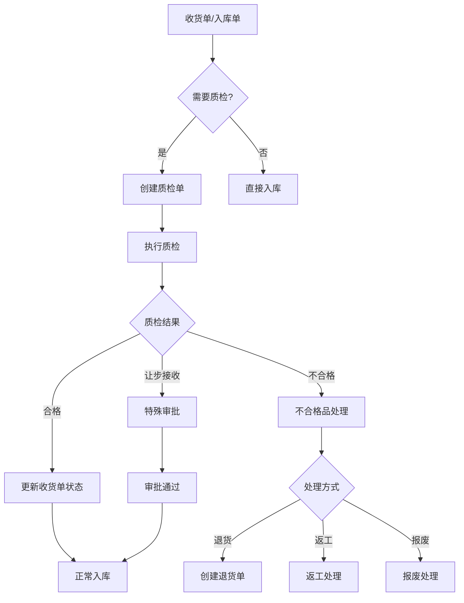
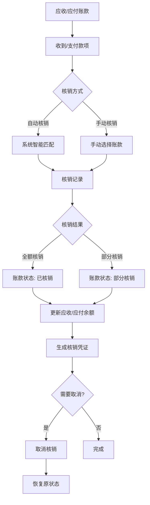
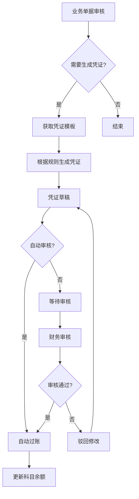

# 第一阶段剩余任务详细实施规划

**创建日期**: 2025-11-11
**规划目标**: 完成第一阶段最后3个任务，实现核心业务功能的100%完整度

---

## 📋 任务概览

| 任务编号 | 任务名称 | 预计工期 | 优先级 | 复杂度 |
|---------|---------|---------|--------|--------|
| 1.6 | 自动凭证生成 | 1.5周 | ⭐⭐⭐⭐⭐ | 高 |
| 1.7 | 核销机制完善 | 1周 | ⭐⭐⭐⭐ | 中 |
| 1.8 | 质检流程 | 1.5周 | ⭐⭐⭐ | 中 |

**总预计工期**: 4周
**建议实施顺序**: 1.8 → 1.7 → 1.6 (由简到难，先完成独立模块)

---

## 🔍 任务1.8: 质检流程 (1.5周)

### 📊 业务背景

质检流程是采购收货和生产入库的重要环节，确保产品质量符合要求。

### 🎯 核心需求

1. **质检单管理**: 对收货单或生产单进行质量检验
2. **质检项目**: 可配置的质检项目和标准
3. **质检结果**: 合格、不合格、让步接收
4. **不合格处理**: 退货、返工、让步接收
5. **质检报告**: 质检记录和统计分析

### 📐 业务流程



### 🗄️ 数据模型设计

#### 1. QualityInspection (质检单)
```python
class QualityInspection(BaseModel):
    """质检单主表"""
    INSPECTION_STATUS = [
        ('pending', '待检'),
        ('in_progress', '检验中'),
        ('passed', '合格'),
        ('failed', '不合格'),
        ('conditional', '让步接收'),
    ]

    inspection_number = CharField('质检单号', unique=True)

    # 关联单据
    source_type = CharField('来源类型', choices=[
        ('purchase_receipt', '采购收货'),
        ('inbound_order', '入库单'),
        ('production', '生产入库'),
    ])
    source_id = IntegerField('来源单据ID')
    source_number = CharField('来源单号')

    # 基本信息
    inspection_date = DateField('质检日期')
    inspector = ForeignKey(User, verbose_name='质检员')
    status = CharField('质检状态', choices=INSPECTION_STATUS)

    # 产品信息
    product = ForeignKey('products.Product')
    batch_number = CharField('批次号', blank=True)
    quantity = DecimalField('质检数量')

    # 质检结果
    passed_quantity = DecimalField('合格数量', default=0)
    failed_quantity = DecimalField('不合格数量', default=0)
    pass_rate = DecimalField('合格率%', default=0)

    # 处理信息
    result = CharField('质检结论')
    notes = TextField('质检备注', blank=True)

    # 审批
    approved_by = ForeignKey(User, null=True, verbose_name='审批人')
    approved_at = DateTimeField('审批时间', null=True)
```

#### 2. QualityInspectionItem (质检明细)
```python
class QualityInspectionItem(BaseModel):
    """质检项目明细"""
    RESULT_CHOICES = [
        ('pass', '合格'),
        ('fail', '不合格'),
        ('na', '不适用'),
    ]

    inspection = ForeignKey(QualityInspection, related_name='items')
    inspection_item = ForeignKey('QualityInspectionTemplate')

    # 质检项目
    item_name = CharField('检验项目')
    standard = CharField('检验标准')
    method = CharField('检验方法', blank=True)

    # 检验结果
    result = CharField('检验结果', choices=RESULT_CHOICES)
    actual_value = CharField('实际值', blank=True)
    notes = TextField('备注', blank=True)

    sort_order = PositiveIntegerField('排序', default=0)
```

#### 3. QualityInspectionTemplate (质检模板)
```python
class QualityInspectionTemplate(BaseModel):
    """质检项目模板"""
    name = CharField('模板名称')
    category = ForeignKey('products.Category', verbose_name='产品分类')

    # 质检项配置
    items = JSONField('质检项目配置')
    # items格式: [
    #   {"name": "外观检查", "standard": "无划痕", "method": "目视"},
    #   {"name": "尺寸测量", "standard": "±0.1mm", "method": "游标卡尺"},
    # ]

    is_active = BooleanField('是否启用', default=True)
```

#### 4. NonConformingProduct (不合格品处理)
```python
class NonConformingProduct(BaseModel):
    """不合格品处理单"""
    HANDLING_STATUS = [
        ('pending', '待处理'),
        ('in_progress', '处理中'),
        ('completed', '已完成'),
    ]

    HANDLING_METHOD = [
        ('return', '退货'),
        ('rework', '返工'),
        ('scrap', '报废'),
        ('conditional_accept', '让步接收'),
    ]

    ncp_number = CharField('不合格品单号', unique=True)
    inspection = ForeignKey(QualityInspection)

    # 基本信息
    product = ForeignKey('products.Product')
    quantity = DecimalField('不合格数量')
    defect_description = TextField('缺陷描述')

    # 处理方式
    handling_method = CharField('处理方式', choices=HANDLING_METHOD)
    handler = ForeignKey(User, verbose_name='处理人')
    handling_date = DateField('处理日期', null=True)
    handling_result = TextField('处理结果', blank=True)

    status = CharField('处理状态', choices=HANDLING_STATUS)

    # 成本
    handling_cost = DecimalField('处理成本', default=0)
```

### 🎨 功能点拆解

#### 阶段1: 质检单管理 (3天)
- [ ] 创建数据模型 (0.5天)
- [ ] 数据库迁移 (0.5天)
- [ ] 质检单CRUD视图 (1天)
  - `inspection_list` - 列表页
  - `inspection_detail` - 详情页
  - `inspection_create` - 创建质检单
  - `inspection_update` - 编辑质检单
  - `inspection_delete` - 删除质检单
- [ ] 质检单模板 (4个) (1天)
  - `inspection_list.html`
  - `inspection_detail.html`
  - `inspection_form.html`
  - `inspection_confirm_delete.html`

#### 阶段2: 质检执行 (2天)
- [ ] 质检项目模板管理 (0.5天)
  - 模板CRUD
  - 质检项配置
- [ ] 质检执行视图 (1天)
  - `inspection_execute` - 执行质检
  - `inspection_approve` - 审批质检
- [ ] 质检执行模板 (1个) (0.5天)
  - `inspection_execute.html` - 质检执行页面

#### 阶段3: 不合格品处理 (2天)
- [ ] 不合格品模型和视图 (1天)
  - `ncp_list` - 不合格品列表
  - `ncp_detail` - 详情
  - `ncp_handle` - 处理不合格品
- [ ] 不合格品模板 (3个) (0.5天)
  - `ncp_list.html`
  - `ncp_detail.html`
  - `ncp_handle.html`
- [ ] 与退货单、报废单集成 (0.5天)

#### 阶段4: 质检报表 (1.5天)
- [ ] 质检统计报表 (1天)
  - 质检合格率统计
  - 供应商质量分析
  - 不合格品统计
- [ ] 报表模板 (2个) (0.5天)
  - `inspection_statistics.html`
  - `supplier_quality_analysis.html`

### 📊 集成点

1. **采购模块集成**
   - 收货单完成后可创建质检单
   - 质检不合格自动创建退货流程

2. **库存模块集成**
   - 质检合格后才能正式入库
   - 不合格品单独存放隔离区

3. **财务模块集成**
   - 不合格品处理成本记录
   - 质量扣款计入供应商账款

### ✅ 验收标准

1. ✅ 可以从收货单创建质检单
2. ✅ 可以配置和使用质检模板
3. ✅ 可以执行质检并记录结果
4. ✅ 质检合格后可以正常入库
5. ✅ 质检不合格可以进行后续处理
6. ✅ 可以查看质检统计报表

---

## 💰 任务1.7: 核销机制完善 (1周)

### 📊 业务背景

核销是财务管理的重要环节，用于匹配应收/应付账款与实际收付款记录，确保账款准确性。

### 🎯 核心需求

1. **自动核销**: 收付款时自动匹配对应的账款
2. **手动核销**: 支持手动选择要核销的账款
3. **部分核销**: 支持一笔款项核销多笔账款
4. **核销记录**: 完整的核销历史记录
5. **取消核销**: 支持取消核销操作

### 📐 业务流程



### 🗄️ 数据模型设计

#### 1. WriteOff (核销记录)
```python
class WriteOff(BaseModel):
    """核销记录"""
    WRITEOFF_TYPE = [
        ('receivable', '应收核销'),
        ('payable', '应付核销'),
    ]

    writeoff_number = CharField('核销单号', unique=True)
    writeoff_type = CharField('核销类型', choices=WRITEOFF_TYPE)
    writeoff_date = DateField('核销日期')

    # 款项信息
    payment_record_type = CharField('款项类型', choices=[
        ('payment_record', '收款记录'),
        ('supplier_payment', '付款记录'),
    ])
    payment_record_id = IntegerField('款项记录ID')
    payment_amount = DecimalField('款项金额')

    # 核销信息
    writeoff_amount = DecimalField('核销金额')
    remaining_amount = DecimalField('剩余金额', default=0)

    # 操作信息
    operator = ForeignKey(User, verbose_name='操作人')
    notes = TextField('备注', blank=True)

    # 取消信息
    is_cancelled = BooleanField('已取消', default=False)
    cancelled_by = ForeignKey(User, null=True, verbose_name='取消人')
    cancelled_at = DateTimeField('取消时间', null=True)
    cancel_reason = TextField('取消原因', blank=True)
```

#### 2. WriteOffItem (核销明细)
```python
class WriteOffItem(BaseModel):
    """核销明细"""
    writeoff = ForeignKey(WriteOff, related_name='items')

    # 账款信息
    account_type = CharField('账款类型', choices=[
        ('customer_account', '客户应收'),
        ('supplier_account', '供应商应付'),
    ])
    account_id = IntegerField('账款ID')

    # 订单信息
    order_number = CharField('订单号')
    original_amount = DecimalField('原始金额')
    previous_writeoff = DecimalField('已核销金额', default=0)

    # 本次核销
    writeoff_amount = DecimalField('本次核销金额')
    remaining_amount = DecimalField('剩余金额')

    notes = TextField('备注', blank=True)
```

#### 3. 扩展现有模型

**CustomerAccount (客户应收) - 添加字段**
```python
class CustomerAccount(BaseModel):
    # ... 现有字段 ...

    # 新增核销相关字段
    writeoff_amount = DecimalField('已核销金额', default=0)
    writeoff_status = CharField('核销状态', choices=[
        ('unwritten', '未核销'),
        ('partial', '部分核销'),
        ('completed', '已核销'),
    ], default='unwritten')
```

**SupplierAccount (供应商应付) - 添加字段**
```python
class SupplierAccount(BaseModel):
    # ... 现有字段 ...

    # 新增核销相关字段
    writeoff_amount = DecimalField('已核销金额', default=0)
    writeoff_status = CharField('核销状态', choices=[
        ('unwritten', '未核销'),
        ('partial', '部分核销'),
        ('completed', '已核销'),
    ], default='unwritten')
```

### 🎨 功能点拆解

#### 阶段1: 模型扩展 (1天)
- [ ] 创建WriteOff和WriteOffItem模型 (0.5天)
- [ ] 扩展CustomerAccount和SupplierAccount (0.25天)
- [ ] 数据库迁移 (0.25天)

#### 阶段2: 核销功能 (2.5天)
- [ ] 应收核销视图 (1天)
  - `receivable_writeoff_create` - 创建应收核销
  - `receivable_writeoff_list` - 核销记录列表
  - `receivable_writeoff_detail` - 核销详情
  - `receivable_writeoff_cancel` - 取消核销
- [ ] 应付核销视图 (1天)
  - `payable_writeoff_create` - 创建应付核销
  - `payable_writeoff_list` - 核销记录列表
  - `payable_writeoff_detail` - 核销详情
  - `payable_writeoff_cancel` - 取消核销
- [ ] 自动核销逻辑 (0.5天)
  - 智能匹配算法
  - 优先级规则

#### 阶段3: 用户界面 (1.5天)
- [ ] 核销创建页面 (2个) (0.75天)
  - `writeoff_create_receivable.html`
  - `writeoff_create_payable.html`
- [ ] 核销列表和详情 (2个) (0.5天)
  - `writeoff_list.html`
  - `writeoff_detail.html`
- [ ] 核销取消确认 (1个) (0.25天)
  - `writeoff_confirm_cancel.html`

#### 阶段4: 集成和测试 (1天)
- [ ] 与收款记录集成 (0.5天)
  - 收款时触发核销
- [ ] 与付款记录集成 (0.5天)
  - 付款时触发核销

### 📊 核销规则

#### 自动核销规则
1. **金额匹配优先**: 优先核销金额完全匹配的账款
2. **日期优先**: 优先核销账龄最长的账款
3. **订单优先**: 优先核销指定订单的账款
4. **部分核销**: 如无完全匹配，按比例分配

#### 核销状态转换
```
未核销 → 部分核销 → 已核销
   ↑         ↑         ↑
   └─────────┴─────────┘
        (取消核销)
```

### ✅ 验收标准

1. ✅ 收款时可以自动核销应收账款
2. ✅ 付款时可以自动核销应付账款
3. ✅ 可以手动选择要核销的账款
4. ✅ 支持一笔款项核销多笔账款
5. ✅ 可以查看完整的核销记录
6. ✅ 可以取消核销并恢复原状态
7. ✅ 核销后账款状态正确更新

---

## 🧾 任务1.6: 自动凭证生成 (1.5周)

### 📊 业务背景

自动凭证生成是财务自动化的关键功能，根据业务单据自动生成会计凭证，减少手工录入，提高准确性。

### 🎯 核心需求

1. **凭证模板**: 可配置的凭证生成规则
2. **自动触发**: 业务单据审核后自动生成凭证
3. **凭证审核**: 凭证需要财务审核确认
4. **凭证查询**: 查看和检索凭证记录
5. **凭证报表**: 科目余额表、试算平衡表

### 📐 业务流程



### 🗄️ 数据模型设计

#### 1. AccountingSubject (会计科目)
```python
class AccountingSubject(BaseModel):
    """会计科目"""
    SUBJECT_TYPE = [
        ('asset', '资产类'),
        ('liability', '负债类'),
        ('equity', '权益类'),
        ('cost', '成本类'),
        ('profit_loss', '损益类'),
    ]

    BALANCE_DIRECTION = [
        ('debit', '借方'),
        ('credit', '贷方'),
    ]

    # 科目编码
    code = CharField('科目编码', unique=True)
    name = CharField('科目名称')
    full_name = CharField('科目全称')

    # 科目属性
    subject_type = CharField('科目类别', choices=SUBJECT_TYPE)
    level = IntegerField('科目级别')  # 1-一级, 2-二级, 3-三级
    parent = ForeignKey('self', null=True, verbose_name='上级科目')

    # 余额方向
    balance_direction = CharField('余额方向', choices=BALANCE_DIRECTION)

    # 辅助核算
    enable_customer = BooleanField('客户辅助核算', default=False)
    enable_supplier = BooleanField('供应商辅助核算', default=False)
    enable_department = BooleanField('部门辅助核算', default=False)
    enable_project = BooleanField('项目辅助核算', default=False)

    # 余额
    current_balance = DecimalField('当前余额', default=0)

    is_active = BooleanField('是否启用', default=True)
```

#### 2. VoucherTemplate (凭证模板)
```python
class VoucherTemplate(BaseModel):
    """凭证模板"""
    name = CharField('模板名称')
    code = CharField('模板编码', unique=True)

    # 触发条件
    trigger_type = CharField('触发类型', choices=[
        ('sales_order_approve', '销售订单审核'),
        ('purchase_order_approve', '采购订单审核'),
        ('payment_record', '收款记录'),
        ('supplier_payment', '付款记录'),
        ('inbound_order_approve', '入库单审核'),
        ('outbound_order_approve', '出库单审核'),
        ('writeoff', '核销'),
    ])

    # 凭证信息
    voucher_type = CharField('凭证类型', default='记')
    summary_template = CharField('摘要模板')  # 如: "销售订单 {order_number}"

    # 分录模板
    entries_template = JSONField('分录模板')
    # entries_template格式: [
    #   {
    #     "debit_subject": "1122",  # 应收账款
    #     "debit_amount": "{total_amount}",
    #     "credit_subject": "6001",  # 主营业务收入
    #     "credit_amount": "{subtotal}",
    #     "auxiliary": {"customer": "{customer_id}"}
    #   },
    #   {
    #     "debit_subject": "1122",
    #     "credit_subject": "2221",  # 应交税费-应交增值税
    #     "amount": "{tax_amount}"
    #   }
    # ]

    # 配置
    auto_approve = BooleanField('自动审核', default=False)
    is_active = BooleanField('是否启用', default=True)
```

#### 3. AccountingVoucher (会计凭证)
```python
class AccountingVoucher(BaseModel):
    """会计凭证"""
    VOUCHER_STATUS = [
        ('draft', '草稿'),
        ('approved', '已审核'),
        ('posted', '已过账'),
        ('cancelled', '已作废'),
    ]

    # 凭证信息
    voucher_number = CharField('凭证字号', unique=True)  # 如: 记-001
    voucher_date = DateField('凭证日期')
    period = CharField('会计期间')  # 如: 2025-11

    # 来源信息
    source_type = CharField('来源类型')  # 如: sales_order
    source_id = IntegerField('来源单据ID')
    source_number = CharField('来源单号')

    # 模板
    template = ForeignKey(VoucherTemplate, null=True, verbose_name='凭证模板')

    # 状态
    status = CharField('凭证状态', choices=VOUCHER_STATUS, default='draft')

    # 金额
    total_debit = DecimalField('借方合计', default=0)
    total_credit = DecimalField('贷方合计', default=0)

    # 审核
    prepared_by = ForeignKey(User, related_name='prepared_vouchers', verbose_name='制单人')
    approved_by = ForeignKey(User, null=True, related_name='approved_vouchers', verbose_name='审核人')
    approved_at = DateTimeField('审核时间', null=True)
    posted_by = ForeignKey(User, null=True, related_name='posted_vouchers', verbose_name='过账人')
    posted_at = DateTimeField('过账时间', null=True)

    notes = TextField('备注', blank=True)
```

#### 4. VoucherEntry (凭证分录)
```python
class VoucherEntry(BaseModel):
    """凭证分录"""
    voucher = ForeignKey(AccountingVoucher, related_name='entries')

    # 科目
    subject = ForeignKey(AccountingSubject, verbose_name='会计科目')
    summary = CharField('摘要')

    # 金额
    debit_amount = DecimalField('借方金额', default=0)
    credit_amount = DecimalField('贷方金额', default=0)

    # 辅助核算
    customer = ForeignKey('customers.Customer', null=True, verbose_name='客户')
    supplier = ForeignKey('suppliers.Supplier', null=True, verbose_name='供应商')
    department = ForeignKey('departments.Department', null=True, verbose_name='部门')

    # 币种
    currency = CharField('币种', default='CNY')
    exchange_rate = DecimalField('汇率', default=1)
    original_amount = DecimalField('原币金额', default=0)

    sort_order = PositiveIntegerField('排序', default=0)
```

#### 5. SubjectBalance (科目余额)
```python
class SubjectBalance(BaseModel):
    """科目余额表"""
    period = CharField('会计期间')  # 如: 2025-11
    subject = ForeignKey(AccountingSubject, verbose_name='会计科目')

    # 期初余额
    opening_balance = DecimalField('期初余额', default=0)
    opening_debit = DecimalField('期初借方', default=0)
    opening_credit = DecimalField('期初贷方', default=0)

    # 本期发生额
    period_debit = DecimalField('本期借方发生', default=0)
    period_credit = DecimalField('本期贷方发生', default=0)

    # 期末余额
    closing_balance = DecimalField('期末余额', default=0)
    closing_debit = DecimalField('期末借方', default=0)
    closing_credit = DecimalField('期末贷方', default=0)

    # 辅助核算
    customer = ForeignKey('customers.Customer', null=True)
    supplier = ForeignKey('suppliers.Supplier', null=True)
    department = ForeignKey('departments.Department', null=True)

    class Meta:
        unique_together = ['period', 'subject', 'customer', 'supplier', 'department']
```

### 🎨 功能点拆解

#### 阶段1: 基础数据 (2天)
- [ ] 会计科目模型和管理 (1天)
  - AccountingSubject模型
  - 科目CRUD视图
  - 科目树形结构
- [ ] 科目管理界面 (1天)
  - `subject_list.html`
  - `subject_form.html`
  - 科目导入功能

#### 阶段2: 凭证模板 (2天)
- [ ] 凭证模板模型 (0.5天)
- [ ] 模板管理视图 (1天)
  - 模板CRUD
  - 模板测试
- [ ] 模板配置界面 (0.5天)
  - `template_list.html`
  - `template_form.html` (JSON编辑器)

#### 阶段3: 凭证生成 (2.5天)
- [ ] 凭证生成引擎 (1天)
  - 模板解析
  - 变量替换
  - 金额计算
- [ ] 凭证管理视图 (1天)
  - `voucher_list` - 凭证列表
  - `voucher_detail` - 凭证详情
  - `voucher_approve` - 凭证审核
  - `voucher_post` - 凭证过账
  - `voucher_cancel` - 凭证作废
- [ ] 凭证界面 (0.5天)
  - `voucher_list.html`
  - `voucher_detail.html`

#### 阶段4: 业务集成 (2天)
- [ ] 销售订单集成 (0.5天)
  - 审核时自动生成凭证
- [ ] 采购订单集成 (0.5天)
  - 审核时自动生成凭证
- [ ] 收付款集成 (0.5天)
  - 收付款时自动生成凭证
- [ ] 核销集成 (0.5天)
  - 核销时自动生成凭证

#### 阶段5: 报表和余额 (1.5天)
- [ ] 科目余额计算 (0.5天)
  - 自动更新科目余额
- [ ] 财务报表 (1天)
  - 科目余额表
  - 试算平衡表
  - 明细账

### 📊 预置科目体系 (简化版)

```
一级科目:
1. 资产类
   1001 库存现金
   1002 银行存款
   1122 应收账款
   1123 预付账款
   1405 原材料
   1406 库存商品

2. 负债类
   2202 应付账款
   2203 预收账款
   2221 应交税费

3. 权益类
   4001 实收资本
   4103 本年利润

4. 成本类
   5001 生产成本
   5101 制造费用

5. 损益类
   6001 主营业务收入
   6051 其他业务收入
   6401 主营业务成本
   6402 其他业务成本
   6601 销售费用
   6602 管理费用
```

### 📝 凭证模板示例

#### 销售订单审核凭证
```json
{
  "trigger_type": "sales_order_approve",
  "summary_template": "销售订单 {order_number}",
  "entries": [
    {
      "subject_code": "1122",
      "subject_name": "应收账款",
      "debit_amount": "{total_amount}",
      "auxiliary": {"customer": "{customer_id}"}
    },
    {
      "subject_code": "6001",
      "subject_name": "主营业务收入",
      "credit_amount": "{subtotal}"
    },
    {
      "subject_code": "2221",
      "subject_name": "应交税费-应交增值税(销项税额)",
      "credit_amount": "{tax_amount}"
    }
  ]
}
```

#### 收款凭证
```json
{
  "trigger_type": "payment_record",
  "summary_template": "收到 {customer_name} 款项",
  "entries": [
    {
      "subject_code": "1002",
      "subject_name": "银行存款",
      "debit_amount": "{amount}"
    },
    {
      "subject_code": "1122",
      "subject_name": "应收账款",
      "credit_amount": "{amount}",
      "auxiliary": {"customer": "{customer_id}"}
    }
  ]
}
```

### ✅ 验收标准

1. ✅ 可以创建和管理会计科目
2. ✅ 可以配置凭证生成模板
3. ✅ 业务单据审核后自动生成凭证
4. ✅ 凭证金额借贷平衡
5. ✅ 可以审核和过账凭证
6. ✅ 凭证过账后自动更新科目余额
7. ✅ 可以查看科目余额表和试算平衡表
8. ✅ 可以作废凭证并恢复余额

---

## 📅 实施时间安排

### 建议实施顺序和时间表

#### Week 1: 质检流程 (7天)
- **Day 1-3**: 质检单管理 + 质检执行
- **Day 4-5**: 不合格品处理
- **Day 6-7**: 质检报表 + 集成测试

#### Week 2: 核销机制 (5天)
- **Day 1**: 模型扩展和数据库迁移
- **Day 2-3**: 核销功能开发
- **Day 4**: 用户界面
- **Day 5**: 集成和测试

#### Week 3-4: 自动凭证生成 (10天)
- **Day 1-2**: 会计科目基础数据
- **Day 3-4**: 凭证模板系统
- **Day 5-7**: 凭证生成引擎
- **Day 8-9**: 业务集成
- **Day 10**: 报表和测试

### 总计: 约4周 (22个工作日)

---

## 🎯 成功标准

### 功能完整性
- ✅ 所有规划的功能点100%实现
- ✅ 所有验收标准通过
- ✅ 与现有模块无缝集成

### 代码质量
- ✅ 遵循Django最佳实践
- ✅ 代码注释完整清晰
- ✅ 无系统检查错误 (python manage.py check)
- ✅ 数据库迁移无冲突

### 用户体验
- ✅ 界面设计与现有系统一致
- ✅ 操作流程直观易用
- ✅ 响应速度快(< 2秒)
- ✅ 错误提示友好

### 文档完善
- ✅ 更新模块CLAUDE.md文档
- ✅ 更新数据库ER图
- ✅ 记录变更日志

---

## 📝 风险评估

### 高风险项
1. **自动凭证生成复杂度高**
   - 风险: 模板配置可能不够灵活
   - 缓解: 先实现简化版本，逐步完善

2. **核销逻辑复杂**
   - 风险: 部分核销、多对多核销场景复杂
   - 缓解: 先实现简单场景，再扩展

### 中等风险项
1. **质检流程与生产模块的边界**
   - 风险: 生产模块未开发，质检流程可能需要调整
   - 缓解: 预留扩展接口

2. **会计科目体系的准确性**
   - 风险: 不同企业科目体系差异大
   - 缓解: 提供灵活的科目配置和导入功能

---

## 🚀 后续优化方向

### 短期优化 (完成后1-2周)
1. 添加单元测试覆盖
2. 性能优化和缓存
3. 用户手册编写

### 中期优化 (1-2个月)
1. 质检流程与生产模块深度集成
2. 更复杂的凭证规则引擎
3. 批量核销功能
4. 移动端质检APP

### 长期优化 (3-6个月)
1. AI辅助质检（图像识别）
2. 智能凭证审核
3. 财务分析和预测
4. 多币种和汇率处理

---

## 📞 技术支持

如在实施过程中遇到问题，可以：
1. 查阅相关模块的CLAUDE.md文档
2. 参考已完成模块的实现模式
3. 运行 `python manage.py check` 检查系统状态
4. 查看Django日志排查错误

---

**规划制定人**: 猫娘 幽浮喵 (浮浮酱)
**规划制定时间**: 2025-11-11
**预计总工期**: 4周 (22个工作日)
**预期完成时间**: 2025-12-09

---

_此文档将作为第一阶段剩余任务的实施指南，请在开发过程中严格遵循 φ(≧ω≦*)♪_
